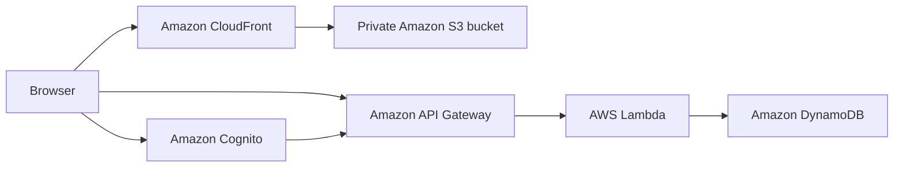

# CrudNotes

CrudNotes is a responsive, authenticated notes app built as a serverless AWS portfolio project. Users can create an account, write and organize notes, and access their own data through a Cognito-protected API.

**Live demo:** [d2ry7dhe3mi7i1.cloudfront.net](https://d2ry7dhe3mi7i1.cloudfront.net)

## Features

- Email sign-up, verification, login, and logout with Amazon Cognito
- Create, read, update, and delete notes
- Automatic saving while editing
- Pinning and searching notes
- Rich-text controls for headings, bold, italics, underline, lists, and checklists
- Light and dark themes
- Responsive desktop and mobile layout, including swipe actions on small screens
- Five-minute inactivity timeout
- Per-user data isolation using the authenticated Cognito user ID

## Architecture



The frontend is a static HTML, CSS, and JavaScript app served through CloudFront from a private S3 bucket. API Gateway validates Cognito tokens before invoking the Node.js Lambda function. Notes are stored in DynamoDB with `userId` as the partition key and `noteId` as the sort key.

## Tech stack

- HTML, CSS, and vanilla JavaScript
- Amazon Cognito
- Amazon API Gateway
- AWS Lambda with Node.js 20
- Amazon DynamoDB
- Amazon S3 and CloudFront
- AWS SAM and CloudFormation
- GitHub Actions

## Project structure

```text
Crudnotes/
├── BACKEND/
│   ├── app.js              # Lambda handler and note operations
│   └── package.json        # Backend dependencies
├── Web/
│   ├── index.html          # Application markup
│   ├── app.js              # Authentication and UI logic
│   └── style.css           # Responsive styling and themes
├── .github/workflows/
│   └── deploy.yml          # Continuous deployment workflow
├── template.yaml           # AWS SAM infrastructure
└── samconfig-v2.toml       # SAM deployment configuration
```

## API

All application routes require a valid Cognito ID token in the `Authorization` header.

| Method | Route | Description |
| --- | --- | --- |
| `GET` | `/notes` | List the signed-in user's notes |
| `POST` | `/notes` | Create a note |
| `PUT` | `/notes/{noteId}` | Update a note's title, content, or pinned state |
| `DELETE` | `/notes/{noteId}` | Delete a note |

A note has the following shape:

```json
{
  "noteId": "uuid",
  "title": "Project ideas",
  "content": "Build a serverless notes app",
  "pinned": false,
  "createdAt": "2026-01-01T12:00:00.000Z",
  "updatedAt": "2026-01-01T12:00:00.000Z"
}
```

## Prerequisites

Before deploying your own copy, install and configure:

- [Node.js 20](https://nodejs.org/)
- [AWS CLI](https://docs.aws.amazon.com/cli/latest/userguide/getting-started-install.html)
- [AWS SAM CLI](https://docs.aws.amazon.com/serverless-application-model/latest/developerguide/install-sam-cli.html)
- An AWS account with permission to create the resources in `template.yaml`

Verify that your AWS credentials are available:

```bash
aws sts get-caller-identity
```

## Deploy your own copy

1. Clone the repository and enter the project directory:

   ```bash
   git clone https://github.com/mandelaokeke/Crudnotes.git
   cd Crudnotes
   ```

2. Build and deploy the backend and infrastructure:

   ```bash
   sam build
   sam deploy --guided
   ```

3. Copy the `ApiUrl`, `UserPoolId`, `UserPoolClientId`, `FrontendBucketName`, `CloudFrontDistributionId`, and `CloudFrontUrl` values from the deployment outputs.

4. Update the following constants at the top of `Web/app.js`:

   ```js
   const API = "YOUR_API_URL";
   const USER_POOL_ID = "YOUR_USER_POOL_ID";
   const USER_POOL_CLIENT_ID = "YOUR_USER_POOL_CLIENT_ID";
   ```

5. Set the API's allowed origin in `template.yaml` to your `CloudFrontUrl`, then build and deploy the stack again:

   ```bash
   sam build
   sam deploy
   ```

6. Upload the frontend and clear the CloudFront cache:

   ```bash
   aws s3 sync Web/ s3://YOUR_FRONTEND_BUCKET --delete
   aws cloudfront create-invalidation \
     --distribution-id YOUR_CLOUDFRONT_DISTRIBUTION_ID \
     --paths "/*"
   ```

Open the `CloudFrontUrl` output to use the app.

## Frontend development

The frontend has no build step. Serve the `Web` directory with any static web server:

```bash
cd Web
python3 -m http.server 8080
```

Then visit [http://localhost:8080](http://localhost:8080). The checked-in frontend is configured for the deployed AWS API and Cognito user pool. If you deploy a separate stack, replace the constants in `Web/app.js` as described above and allow your local origin in the API CORS configuration when needed.

## Continuous deployment

Every push to `main` runs the GitHub Actions deployment workflow. Configure these repository secrets before enabling it:

| Secret | Purpose |
| --- | --- |
| `AWS_ACCESS_KEY_ID` | AWS access key used by the workflow |
| `AWS_SECRET_ACCESS_KEY` | AWS secret key used by the workflow |
| `AWS_REGION` | Deployment region, currently `us-east-1` |
| `FRONTEND_BUCKET` | S3 bucket that receives the files in `Web/` |
| `CLOUDFRONT_DISTRIBUTION_ID` | Distribution invalidated after each frontend upload |

For production use, prefer GitHub's AWS OpenID Connect integration and short-lived credentials instead of long-lived access keys.

## Security notes

- API Gateway protects note routes with a Cognito authorizer.
- The Lambda function scopes every DynamoDB operation to the authenticated user's ID.
- The frontend bucket is private and readable only through CloudFront Origin Access Control.
- Cognito IDs and API URLs in frontend JavaScript identify public client resources; they are configuration values, not secrets.

## License

No license has been added to this repository. All rights are reserved by the repository owner unless a license is provided.
